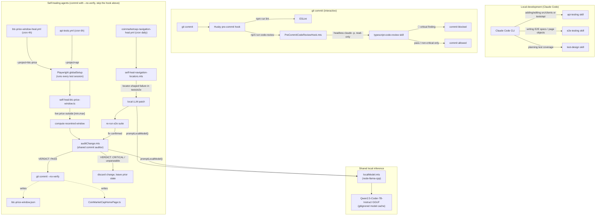

# cmc-tests

Automated API and end-to-end tests for [CoinMarketCap](https://coinmarketcap.com), written in TypeScript with Playwright. Results from every run are reported to Allure and published on GitHub Pages.

## Allure reports

| Report | Link |
|---|---|
| Summary of all reports | https://nknysh.github.io/cmc-tests/ |
| API tests (simple-price) | https://nknysh.github.io/cmc-tests/api/ |
| BTC price window | https://nknysh.github.io/cmc-tests/btc-price/ |
| Navigation e2e | https://nknysh.github.io/cmc-tests/navigation/ |

Reports are regenerated by the CI workflows and served from the `gh-pages` branch. Run history accumulates in `allure-history.jsonl` on that branch, so each report shows trends across runs.

## Technologies

**Language and runtime**
- TypeScript (`typescript` is aliased to `@typescript/typescript6`; TypeScript 7 is installed alongside)
- Node.js 24+

**Testing**
- [Playwright Test](https://playwright.dev) for API specs (no browser) and browser E2E specs (Desktop Chrome)
- Page Object Model for E2E tests
- Typed HTTP clients for third-party APIs (CoinMarketCap client in `src/clients/`)

**Reporting**
- [Allure Report 3](https://allurereport.org) (`allure`) with `allure-playwright`
- Playwright HTML reporter and list reporter
- GitHub Pages for hosting reports

**Code quality**
- ESLint with typescript-eslint and eslint-plugin-playwright
- Husky pre-commit hook running lint and an AI code review (`claude -p` with the `typescript-code-review` skill)

**CI/CD**
- GitHub Actions: scheduled and manually triggered workflows for API tests, BTC price window, and navigation E2E

**Self-healing agents**
- BTC price window: recentres the expected price range when live price drifts outside it
- Navigation locators: repairs the homepage page object using a local LLM (Qwen2.5-Coder-7B-Instruct GGUF via `node-llama-cpp`, no external API)

**AI tooling**
- Claude Code with project skills (`api-testing`, `e2e-testing`) and the Playwright MCP server (`@playwright/mcp`)

**Other**
- `dotenv` for environment configuration

## Setup

```bash
npm install
npx playwright install chromium
cp .env.example .env   # then set CMC_API_KEY (CoinMarketCap Pro API key)
```

## Commands

```bash
npm test                # all specs
npm run test:api        # API specs (simple-price)
npm run test:btc-price  # BTC price window spec
npm run test:e2e        # browser E2E specs
npm run test:ui         # Playwright UI mode
npm run test:headed     # headed browser

npm run test:allure     # run all specs, then build the Allure report
npm run allure:generate # build allure-report/ from allure-results/
npm run allure:open     # open the generated report

npm run lint            # ESLint
npx tsc --noEmit        # type-check
```

## Test case viewer

A read-only web UI for browsing the test cases database (`data/test-cases.db`): a collapsible suite tree, the tests in each suite, and a detail view for each test case (description, preconditions, steps). Suites and test cases are shown with their IDs (`#<id> <name>`), and test cases without a suite appear under "Unsorted".

```bash
npm install     # first time only
npm run viewer  # then open http://127.0.0.1:4000
```

Stop it with `Ctrl+C`. The server only listens on `127.0.0.1`. Restart it after editing `index.html`, since the page is read once at startup.

| Env var | Default | Purpose |
|---|---|---|
| `PORT` | `4000` | Port to listen on |
| `TEST_CASES_DB` | `data/test-cases.db` | Path to the SQLite database file |

Test case URLs are shareable, e.g. `http://127.0.0.1:4000/#case/2` (also `#suite/<id>` and `#unsorted`).

## Agents, skills & hooks



- **Skills** (`api-testing`, `e2e-testing`, `test-design`, `typescript-code-review`) are conventions Claude Code loads for a matching task — the first three during interactive development, the last one only inside the headless review invoked by the pre-commit hook.
- **Hooks**: the Husky `pre-commit` hook is the only one wired into `git commit` directly; it runs lint then `PreCommitCodeReviewHook.mts`, which blocks on 🔴 critical findings from the `typescript-code-review` skill. Both self-heal agents deliberately bypass it (`--no-verify`) since they depend on a local model instead of the paid `claude -p` call this hook makes.
- **Agents**: the BTC price window heal (triggered by every Playwright run via `globalSetup`, and by its own and the API-tests cron workflows) and the navigation locator heal (its own daily cron) each propose a change, then both route through the same `auditChange.mts` gate before committing — the one guardrail standing in for the pre-commit hook they skip. Patch generation (navigation heal) and the audit itself both call the same `localModel.mts` helper, which drives the shared, gitignored, locally-cached GGUF model.

## Project layout

```
src/clients/           typed API clients (CoinMarketCap)
src/db/testCases/      SQLite test case store
src/web/testCaseViewer/ test case viewer (server + page)
tests/api/             API specs
tests/e2e/             E2E specs and page objects
.agents/               self-healing agents and the pre-commit review hook
.github/workflows/     CI workflows
allurerc.mjs           Allure configuration
```

See [CLAUDE.md](CLAUDE.md) for detailed conventions and architecture.
